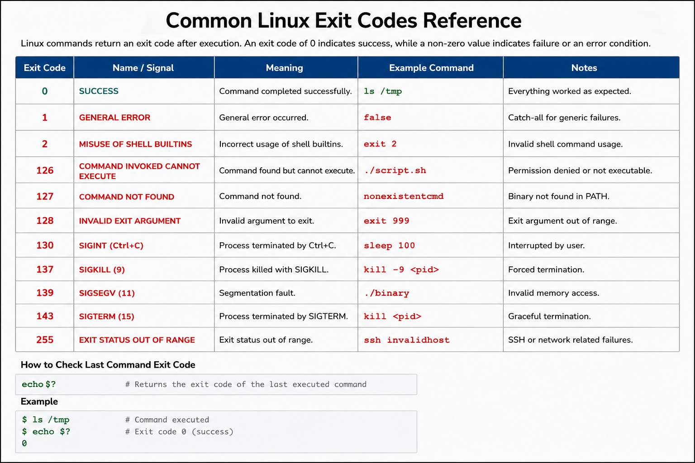

# Common Linux Exit Codes Reference

## Overview

This document provides a quick-reference guide for common Linux command and process exit codes used during enterprise troubleshooting, automation validation, scripting workflows, and operational diagnostics on RHEL 9.6 systems.

Exit codes are critical for validating command execution, automation reliability, service health, and troubleshooting workflows.

---

# Objective

In this reference guide you will:

- Understand common Linux exit codes
- Validate command execution workflows
- Troubleshoot failed operations
- Analyze shell scripting failures
- Verify automation reliability
- Interpret process termination codes
- Improve operational troubleshooting
- Validate enterprise automation workflows

---

# Understanding Exit Codes

Linux commands return an exit code after execution.

General rules:

| Exit Code | Meaning |
|---|---|
| 0 | Success |
| Non-zero | Failure or warning |

---

View the last command exit code.

```bash
echo $?
```

Expected output:

```text
0
```

---

# Common Exit Codes

| Exit Code | Meaning | Example |
|---|---|---|
| 0 | Success | Command completed successfully |
| 1 | General error | Generic failure |
| 2 | Misuse of shell builtins | Invalid shell usage |
| 126 | Command cannot execute | Permission issue |
| 127 | Command not found | Missing binary |
| 128 | Invalid exit argument | Fatal error |
| 130 | Script terminated by Ctrl+C | SIGINT |
| 137 | Process killed | SIGKILL |
| 139 | Segmentation fault | Invalid memory access |
| 143 | Process terminated | SIGTERM |
| 255 | Exit status out of range | SSH failures |

---

# Validate Successful Commands

Run successful command.

```bash
ls /tmp
```

---

Verify exit code.

```bash
echo $?
```

Expected output:

```text
0
```

---

# Validate General Error

Run invalid ls command.

```bash
ls /nonexistent-directory
```

Expected output:

```text
No such file or directory
```

---

Verify exit code.

```bash
echo $?
```

Expected output:

```text
2
```

---

# Validate Permission Denied

Create non-executable script.

```bash
touch test-script.sh
```

---

Attempt execution.

```bash
./test-script.sh
```

Expected output:

```text
Permission denied
```

---

Verify exit code.

```bash
echo $?
```

Expected output:

```text
126
```

---

# Validate Command Not Found

Run invalid command.

```bash
invalidcommand
```

Expected output:

```text
command not found
```

---

Verify exit code.

```bash
echo $?
```

Expected output:

```text
127
```

---

# Validate Interrupted Process

Run sleep command.

```bash
sleep 100
```

---

Interrupt process using:

```text
CTRL+C
```

---

Verify exit code.

```bash
echo $?
```

Expected output:

```text
130
```

---

# Validate Killed Process

Run long-running process.

```bash
sleep 500 &
```

---

Identify process ID.

```bash
ps -ef | grep sleep
```

---

Kill process.

```bash
kill -9 PID
```

---

Verify exit code.

```bash
echo $?
```

Expected output:

```text
137
```

---

# Validate SSH Failure Exit Code

Attempt invalid SSH connection.

```bash
ssh invalidhost
```

Expected output:

```text
Could not resolve hostname
```

---

Verify exit code.

```bash
echo $?
```

Expected output:

```text
255
```

---

# Shell Script Exit Code Validation

Create test script.

```bash
vi test-exit.sh
```

---

Add script content.

```bash
#!/bin/bash

echo "Validation successful"

exit 0
```

---

Apply execute permissions.

```bash
chmod +x test-exit.sh
```

---

Run validation script.

```bash
./test-exit.sh
```

Expected output:

```text
Validation successful
```

---

Verify exit code.

```bash
echo $?
```

Expected output:

```text
0
```

---

# Conditional Exit Code Handling

Validate command success.

```bash
if ls /tmp; then
    echo "Success"
else
    echo "Failure"
fi
```

---

Validate command failure.

```bash
if ls /invalid; then
    echo "Success"
else
    echo "Failure"
fi
```

Expected output:

```text
Failure
```

---

# Monitoring Validation

Monitor failed services.

```bash
systemctl --failed
```

---

Verify service exit status.

```bash
systemctl status sshd
```

Expected output:

```text
status=0/SUCCESS
```

---

Monitor active processes.

```bash
top
```

Expected output:

```text
Tasks:
```

---

# Logging Validation

Review system logs.

```bash
journalctl -n 20
```

Expected output:

```text
systemd
```

---

Review failed service logs.

```bash
journalctl -p err
```

Expected output:

```text
error
```

---

Review authentication failures.

```bash
journalctl | grep failed
```

Expected output:

```text
Failed
```

---

# Troubleshooting

Validate script permissions.

```bash
ls -l test-exit.sh
```

Expected output:

```text
-rwxr-xr-x
```

---

Validate command path.

```bash
which bash
```

Expected output:

```text
/bin/bash
```

---

Validate active processes.

```bash
ps -ef
```

---

Validate environment variables.

```bash
env
```

---

# Operational Recommendations

- Always validate exit codes in automation
- Log command failures consistently
- Use conditional checks in shell scripts
- Monitor failed services continuously
- Validate permissions before execution
- Centralize operational logging
- Document automation failures
- Standardize troubleshooting workflows

---

# Operational Notes

Linux exit codes are critical for enterprise automation reliability, operational validation, and troubleshooting workflows.

During troubleshooting validate:

- Command execution status
- Service exit states
- Script permissions
- Active processes
- System logs
- Environment variables
- Authentication failures

---

# Expected Outcome

After completing this reference guide:

- Linux exit codes are understood correctly
- Automation validation workflows improve
- Troubleshooting workflows become more reliable
- Script validation operates correctly
- Operational diagnostics improve
- Enterprise automation troubleshooting workflows are validated

---


