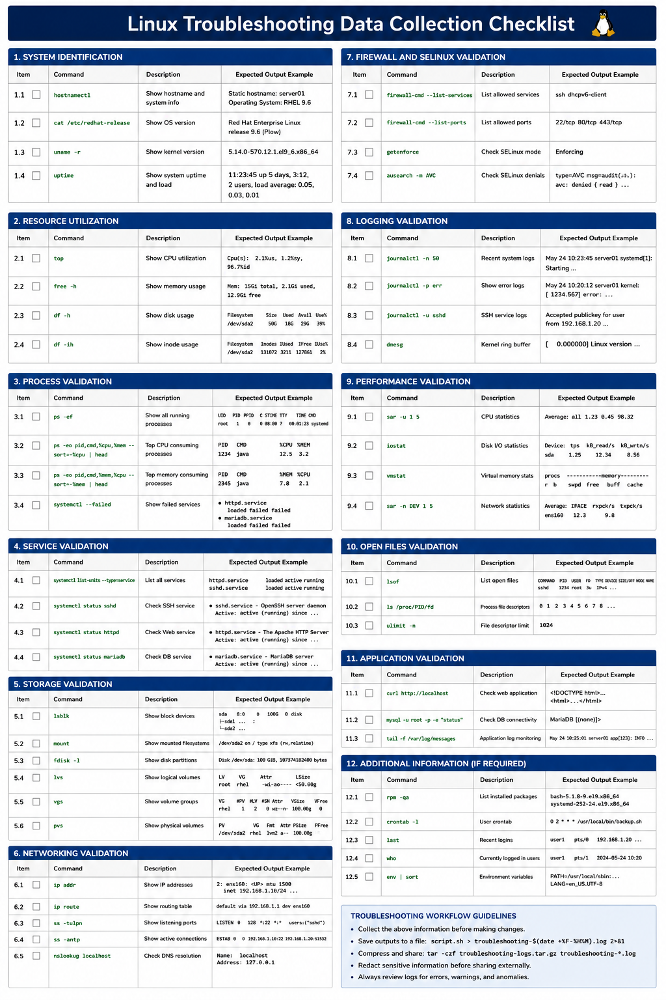

# Linux Troubleshooting Data Collection Checklist

## Overview

This document provides a structured enterprise Linux troubleshooting checklist for collecting operational, performance, networking, storage, and service-related diagnostic information on RHEL 9.6 systems.

Proper data collection is critical for root cause analysis, escalation workflows, incident response, and operational troubleshooting.

---

# Objective

In this checklist you will:

- Collect system diagnostic information
- Validate service health
- Analyze performance metrics
- Review storage utilization
- Capture networking information
- Validate application status
- Collect operational logs
- Support root cause analysis workflows

---

# System Identification

Collect hostname information.

```bash
hostnamectl
```

Expected output:

```text
Static hostname
```

---

Collect operating system version.

```bash
cat /etc/redhat-release
```

Expected output:

```text
Red Hat Enterprise Linux
```

---

Collect kernel version.

```bash
uname -r
```

Expected output:

```text
el9
```

---

Collect uptime information.

```bash
uptime
```

Expected output:

```text
load average
```

---

# Resource Utilization

Collect CPU utilization.

```bash
top
```

Expected output:

```text
Cpu(s)
```

---

Collect memory utilization.

```bash
free -h
```

Expected output:

```text
Mem:
```

---

Collect disk usage information.

```bash
df -h
```

Expected output:

```text
Filesystem
```

---

Collect inode utilization.

```bash
df -ih
```

Expected output:

```text
IUse%
```

---

# Process Validation

Collect active process information.

```bash
ps -ef
```

Expected output:

```text
PID
```

---

Collect top CPU-consuming processes.

```bash
ps -eo pid,cmd,%cpu,%mem --sort=-%cpu | head
```

Expected output:

```text
%CPU
```

---

Collect top memory-consuming processes.

```bash
ps -eo pid,cmd,%mem,%cpu --sort=-%mem | head
```

Expected output:

```text
%MEM
```

---

Validate failed processes.

```bash
systemctl --failed
```

Expected output:

```text
loaded units listed
```

---

# Service Validation

Verify active services.

```bash
systemctl list-units --type=service
```

Expected output:

```text
running
```

---

Verify SSH service.

```bash
systemctl status sshd
```

Expected output:

```text
active (running)
```

---

Verify web services.

```bash
systemctl status httpd
```

Expected output:

```text
active (running)
```

---

Verify database services.

```bash
systemctl status mariadb
```

Expected output:

```text
active (running)
```

---

# Storage Validation

Collect block device layout.

```bash
lsblk
```

Expected output:

```text
disk
```

---

Collect mounted filesystem information.

```bash
mount
```

Expected output:

```text
xfs
```

---

Collect partition layout.

```bash
fdisk -l
```

Expected output:

```text
Disk /dev
```

---

Collect LVM information.

```bash
lvs
vgs
pvs
```

Expected output:

```text
VG
LV
PV
```

---

# Networking Validation

Collect interface information.

```bash
ip addr
```

Expected output:

```text
inet
```

---

Collect routing table.

```bash
ip route
```

Expected output:

```text
default via
```

---

Collect listening ports.

```bash
ss -tulpn
```

Expected output:

```text
LISTEN
```

---

Collect active connections.

```bash
ss -antp
```

Expected output:

```text
ESTAB
```

---

Validate DNS resolution.

```bash
nslookup localhost
```

Expected output:

```text
127.0.0.1
```

---

# Firewall and SELinux Validation

Verify firewall services.

```bash
firewall-cmd --list-services
```

Expected output:

```text
ssh
```

---

Verify firewall ports.

```bash
firewall-cmd --list-ports
```

Expected output:

```text
80/tcp
```

---

Verify SELinux mode.

```bash
getenforce
```

Expected output:

```text
Enforcing
```

---

Collect SELinux denials.

```bash
ausearch -m AVC
```

Expected output:

```text
avc: denied
```

---

# Logging Validation

Collect recent system logs.

```bash
journalctl -n 50
```

Expected output:

```text
systemd
```

---

Collect failed service logs.

```bash
journalctl -p err
```

Expected output:

```text
error
```

---

Collect authentication logs.

```bash
journalctl -u sshd
```

Expected output:

```text
Accepted publickey
```

---

Collect kernel logs.

```bash
dmesg
```

Expected output:

```text
kernel
```

---

# Performance Validation

Collect SAR statistics.

```bash
sar -u 1 5
```

Expected output:

```text
Average
```

---

Collect disk I/O statistics.

```bash
iostat
```

Expected output:

```text
Device
```

---

Collect memory statistics.

```bash
vmstat
```

Expected output:

```text
free
```

---

Collect network statistics.

```bash
sar -n DEV 1 5
```

Expected output:

```text
IFACE
```

---

# Open Files Validation

Collect open file information.

```bash
lsof
```

Expected output:

```text
COMMAND
```

---

Collect process file descriptors.

```bash
ls /proc/PID/fd
```

Expected output:

```text
0
1
2
```

---

Verify file descriptor limits.

```bash
ulimit -n
```

Expected output:

```text
1024
```

---

# Application Validation

Verify web application response.

```bash
curl http://localhost
```

Expected output:

```text
HTML
```

---

Verify database connectivity.

```bash
mysql -u root -p
```

Expected output:

```text
MariaDB
```

---

Verify application logs.

```bash
tail -f /var/log/messages
```

Expected output:

```text
INFO
```

---

# Troubleshooting Workflow

During troubleshooting collect:

- Hostname and OS information
- CPU and memory utilization
- Disk and inode utilization
- Running and failed services
- Network interfaces and connections
- Firewall and SELinux state
- Authentication logs
- Application and kernel logs
- Open file statistics
- Performance metrics

---

# Operational Recommendations

- Standardize troubleshooting workflows
- Centralize diagnostic log collection
- Capture logs before rebooting systems
- Validate resource utilization regularly
- Monitor failed services continuously
- Document troubleshooting evidence
- Automate operational reporting
- Maintain historical troubleshooting records

---

# Operational Notes

Enterprise Linux troubleshooting requires consistent data collection to improve operational reliability and root cause analysis accuracy.

During troubleshooting validate:

- System health
- Service availability
- Network connectivity
- Storage utilization
- SELinux enforcement
- Firewall exposure
- Performance bottlenecks
- Authentication activity

---

# Expected Outcome

After completing this checklist:

- Operational diagnostic data is collected correctly
- Root cause analysis workflows improve
- Troubleshooting consistency increases
- Service validation workflows operate correctly
- Enterprise troubleshooting operations become more reliable

---


