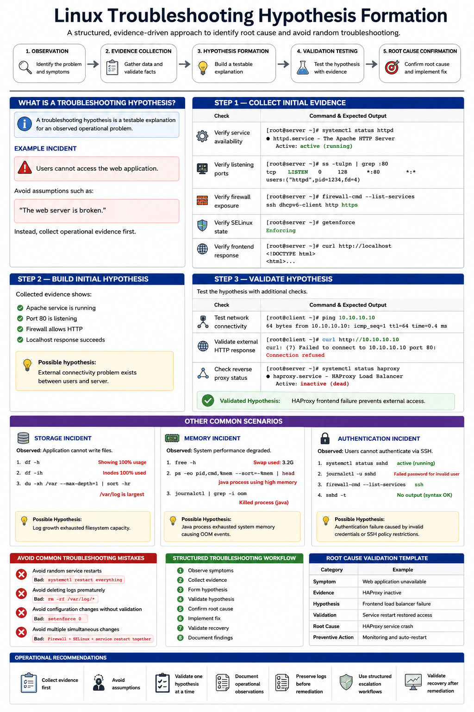

# Linux Troubleshooting Hypothesis Formation

## Overview

This document explains how to build structured troubleshooting hypotheses during enterprise Linux incident response and operational diagnostics on RHEL 9.6 systems.

Hypothesis-driven troubleshooting improves operational consistency, reduces unnecessary changes, accelerates root cause analysis, and supports enterprise incident management workflows.

---

# Objective

In this guide you will:

- Understand troubleshooting hypothesis formation
- Build structured diagnostic workflows
- Validate assumptions using evidence
- Avoid random troubleshooting changes
- Improve root cause analysis
- Validate operational observations
- Structure escalation workflows
- Improve enterprise troubleshooting reliability

---

# What Is a Troubleshooting Hypothesis?

A troubleshooting hypothesis is:

> A testable explanation for an observed operational problem.

The troubleshooting process should always follow:

```text
Observation
    ↓
Evidence Collection
    ↓
Hypothesis Formation
    ↓
Validation Testing
    ↓
Root Cause Confirmation
```

---

# Initial Incident Observation

Example operational incident:

```text
Users cannot access the web application.
```

---

Avoid assumptions such as:

```text
"The web server is broken."
```

Instead collect operational evidence first.

---

# Step 1 — Collect Initial Evidence

Verify service availability.

```bash
systemctl status httpd
```

Expected output:

```text
active (running)
```

---

Verify listening ports.

```bash
ss -tulpn | grep :80
```

Expected output:

```text
LISTEN
```

---

Verify firewall exposure.

```bash
firewall-cmd --list-services
```

Expected output:

```text
http
```

---

Verify SELinux state.

```bash
getenforce
```

Expected output:

```text
Enforcing
```

---

Verify frontend response.

```bash
curl http://localhost
```

Expected output:

```text
HTML
```

---

# Step 2 — Build Initial Hypothesis

Collected evidence shows:

- Apache service is running
- Port 80 is listening
- Firewall allows HTTP
- Localhost response succeeds

Possible hypothesis:

```text
External connectivity problem exists between users and server.
```

---

# Step 3 — Validate Hypothesis

Test network connectivity.

```bash
ping SERVER_IP
```

Expected output:

```text
64 bytes
```

---

Validate external HTTP response.

```bash
curl http://SERVER_IP
```

Expected output:

```text
Connection refused
```

---

Check reverse proxy status.

```bash
systemctl status haproxy
```

Expected output:

```text
inactive (dead)
```

---

Validated hypothesis:

```text
HAProxy frontend failure prevents external access.
```

---

# Example — Storage Incident

Observed issue:

```text
Application cannot write files.
```

---

Collect filesystem utilization.

```bash
df -h
```

Expected output:

```text
100%
```

---

Validate inode exhaustion.

```bash
df -ih
```

Expected output:

```text
IUse%
```

---

Inspect largest directories.

```bash
du -xh /var --max-depth=1 | sort -hr
```

Expected output:

```text
/log
```

---

Possible hypothesis:

```text
Log growth exhausted filesystem capacity.
```

---

# Example — Memory Incident

Observed issue:

```text
System performance degraded significantly.
```

---

Collect memory utilization.

```bash
free -h
```

Expected output:

```text
Swap used
```

---

Collect top memory consumers.

```bash
ps -eo pid,cmd,%mem --sort=-%mem | head
```

Expected output:

```text
java
```

---

Collect OOM events.

```bash
journalctl | grep -i oom
```

Expected output:

```text
Killed process
```

---

Validated hypothesis:

```text
Java process exhausted system memory causing OOM events.
```

---

# Example — Authentication Incident

Observed issue:

```text
Users cannot authenticate through SSH.
```

---

Verify SSH daemon state.

```bash
systemctl status sshd
```

Expected output:

```text
active (running)
```

---

Review authentication logs.

```bash
journalctl -u sshd
```

Expected output:

```text
Failed password
```

---

Verify firewall rules.

```bash
firewall-cmd --list-services
```

Expected output:

```text
ssh
```

---

Validate SSH configuration syntax.

```bash
sshd -t
```

Expected output:

```text
No output
```

---

Possible hypothesis:

```text
Authentication failure caused by invalid credentials or SSH policy restrictions.
```

---

# Avoid Common Troubleshooting Mistakes

Avoid random service restarts.

Bad example:

```bash
systemctl restart everything
```

---

Avoid deleting logs prematurely.

Bad example:

```bash
rm -rf /var/log/*
```

---

Avoid configuration changes without validation.

Bad example:

```bash
setenforce 0
```

---

Avoid multiple simultaneous changes.

Bad example:

```text
Firewall + SELinux + service restart together
```

---

# Structured Troubleshooting Workflow

Recommended workflow:

```text
1. Observe symptoms
2. Collect evidence
3. Form hypothesis
4. Validate hypothesis
5. Confirm root cause
6. Implement fix
7. Validate recovery
8. Document findings
```

---

# Monitoring Validation

Monitor active services.

```bash
systemctl list-units --type=service
```

Expected output:

```text
running
```

---

Monitor active connections.

```bash
ss -antp
```

Expected output:

```text
ESTAB
```

---

Monitor system performance.

```bash
top
```

Expected output:

```text
load average
```

---

# Logging Validation

Review recent system logs.

```bash
journalctl -n 50
```

Expected output:

```text
systemd
```

---

Review failed service logs.

```bash
journalctl -p err
```

Expected output:

```text
error
```

---

Review kernel events.

```bash
dmesg
```

Expected output:

```text
kernel
```

---

# Root Cause Validation Template

Use the following structure:

| Category | Example |
|---|---|
| Symptom | Web application unavailable |
| Evidence | HAProxy inactive |
| Hypothesis | Frontend load balancer failure |
| Validation | Service restart restored access |
| Root Cause | HAProxy service crash |
| Preventive Action | Monitoring and auto-restart |

---

# Operational Recommendations

- Always collect evidence first
- Avoid assumptions during incidents
- Validate one hypothesis at a time
- Document operational observations
- Avoid simultaneous troubleshooting changes
- Preserve logs before remediation
- Use structured escalation workflows
- Validate recovery after remediation

---

# Operational Notes

Hypothesis-driven troubleshooting improves operational consistency and reduces risk during enterprise Linux incident response workflows.

During troubleshooting validate:

- Service state
- Network connectivity
- Resource utilization
- Storage capacity
- Firewall exposure
- SELinux state
- Authentication logs
- Application response

---

# Expected Outcome

After completing this guide:

- Troubleshooting workflows become structured
- Root cause analysis improves
- Operational reliability increases
- Troubleshooting risk decreases
- Incident response workflows improve
- Enterprise diagnostics become more consistent

---


