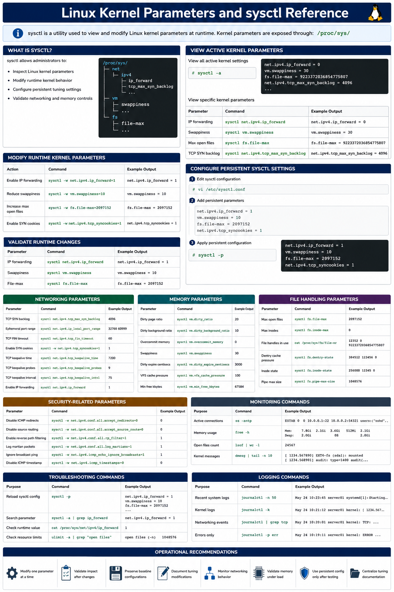

# Linux Kernel Parameters and sysctl Reference

## Overview

This document provides a practical enterprise Linux reference for inspecting, modifying, validating, and troubleshooting Linux kernel parameters using sysctl on RHEL 9.6 systems.

Kernel tuning impacts networking, memory management, file handling, security, and overall operational reliability.

---

# Objective

In this reference guide you will:

- Understand Linux kernel parameters
- Inspect active sysctl values
- Modify runtime kernel settings
- Configure persistent kernel parameters
- Validate networking parameters
- Tune memory-related settings
- Troubleshoot operational issues
- Validate enterprise Linux tuning workflows

---

# What Is sysctl?

`sysctl` allows administrators to:

- Inspect Linux kernel parameters
- Modify runtime kernel behavior
- Configure persistent tuning settings
- Validate networking and memory controls

Kernel parameters are exposed through:

```text
/proc/sys/
```

---

# View All Active Kernel Parameters

Display all active kernel settings.

```bash
sysctl -a
```

Expected output:

```text
net.ipv4.ip_forward
vm.swappiness
fs.file-max
```

---

# View Specific Kernel Parameters

View IP forwarding status.

```bash
sysctl net.ipv4.ip_forward
```

Expected output:

```text
net.ipv4.ip_forward = 0
```

---

View swappiness value.

```bash
sysctl vm.swappiness
```

Expected output:

```text
vm.swappiness = 30
```

---

View maximum open files.

```bash
sysctl fs.file-max
```

Expected output:

```text
fs.file-max
```

---

# Modify Runtime Kernel Parameters

Enable IP forwarding temporarily.

```bash
sysctl -w net.ipv4.ip_forward=1
```

Expected output:

```text
net.ipv4.ip_forward = 1
```

---

Reduce swap aggressiveness.

```bash
sysctl -w vm.swappiness=10
```

Expected output:

```text
vm.swappiness = 10
```

---

Increase maximum open files.

```bash
sysctl -w fs.file-max=2097152
```

Expected output:

```text
fs.file-max = 2097152
```

---

# Validate Runtime Changes

Verify IP forwarding.

```bash
sysctl net.ipv4.ip_forward
```

Expected output:

```text
1
```

---

Verify swappiness.

```bash
sysctl vm.swappiness
```

Expected output:

```text
10
```

---

Verify file limits.

```bash
sysctl fs.file-max
```

Expected output:

```text
2097152
```

---

# Configure Persistent sysctl Settings

Edit sysctl configuration.

```bash
vi /etc/sysctl.conf
```

---

Add persistent parameters.

```text
net.ipv4.ip_forward = 1
vm.swappiness = 10
fs.file-max = 2097152
```

---

Apply persistent configuration.

```bash
sysctl -p
```

Expected output:

```text
net.ipv4.ip_forward = 1
```

---

# Networking Kernel Parameters

View TCP SYN backlog.

```bash
sysctl net.ipv4.tcp_max_syn_backlog
```

Expected output:

```text
4096
```

---

View ephemeral port range.

```bash
sysctl net.ipv4.ip_local_port_range
```

Expected output:

```text
32768 60999
```

---

View TCP timeout settings.

```bash
sysctl net.ipv4.tcp_fin_timeout
```

Expected output:

```text
60
```

---

Enable TCP SYN cookies.

```bash
sysctl -w net.ipv4.tcp_syncookies=1
```

Expected output:

```text
1
```

---

# Memory Kernel Parameters

View dirty page ratio.

```bash
sysctl vm.dirty_ratio
```

Expected output:

```text
20
```

---

View dirty background ratio.

```bash
sysctl vm.dirty_background_ratio
```

Expected output:

```text
10
```

---

View overcommit memory setting.

```bash
sysctl vm.overcommit_memory
```

Expected output:

```text
0
```

---

View swap behavior.

```bash
sysctl vm.swappiness
```

Expected output:

```text
30
```

---

# File Handling Parameters

View maximum open files.

```bash
sysctl fs.file-max
```

Expected output:

```text
file-max
```

---

View inode limits.

```bash
sysctl fs.inode-max
```

Expected output:

```text
inode-max
```

---

View current open file handles.

```bash
cat /proc/sys/fs/file-nr
```

Expected output:

```text
allocated
```

---

# Security-Related Parameters

Disable ICMP redirects.

```bash
sysctl -w net.ipv4.conf.all.accept_redirects=0
```

Expected output:

```text
0
```

---

Disable source routing.

```bash
sysctl -w net.ipv4.conf.all.accept_source_route=0
```

Expected output:

```text
0
```

---

Enable reverse path filtering.

```bash
sysctl -w net.ipv4.conf.all.rp_filter=1
```

Expected output:

```text
1
```

---

# Monitoring Validation

Monitor active connections.

```bash
ss -antp
```

Expected output:

```text
ESTAB
```

---

Monitor memory usage.

```bash
free -h
```

Expected output:

```text
Mem:
```

---

Monitor open files.

```bash
lsof | wc -l
```

Expected output:

```text
number
```

---

Monitor kernel messages.

```bash
dmesg
```

Expected output:

```text
kernel
```

---

# Logging Validation

Review recent system logs.

```bash
journalctl -n 50
```

Expected output:

```text
systemd
```

---

Review kernel logs.

```bash
journalctl -k
```

Expected output:

```text
kernel
```

---

Review networking events.

```bash
journalctl | grep tcp
```

Expected output:

```text
tcp
```

---

# Troubleshooting

Validate sysctl syntax.

```bash
sysctl -p
```

Expected output:

```text
parameter
```

---

Verify active parameters.

```bash
sysctl -a | grep ip_forward
```

Expected output:

```text
1
```

---

Verify runtime kernel values.

```bash
cat /proc/sys/net/ipv4/ip_forward
```

Expected output:

```text
1
```

---

Verify system resource limits.

```bash
ulimit -a
```

Expected output:

```text
open files
```

---

# Operational Recommendations

- Modify one kernel parameter at a time
- Validate operational impact after changes
- Preserve baseline sysctl configurations
- Document tuning modifications carefully
- Monitor networking behavior after changes
- Validate memory tuning under load
- Use persistent configuration only after testing
- Centralize operational tuning documentation

---

# Operational Notes

Linux kernel parameter tuning directly impacts networking, memory management, storage operations, and enterprise workload performance.

During troubleshooting validate:

- Active sysctl parameters
- Runtime kernel values
- Open file limits
- Networking behavior
- Memory utilization
- Kernel messages
- TCP connection states
- Application performance

---

# Expected Outcome

After completing this reference guide:

- Linux kernel parameters are understood correctly
- Runtime tuning workflows operate successfully
- Persistent sysctl configuration functions correctly
- Operational troubleshooting workflows improve
- Enterprise Linux tuning reliability increases

---


