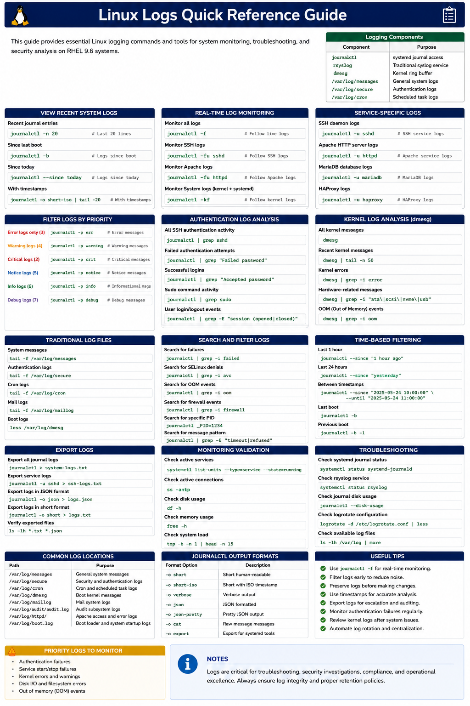

# Linux Logs Quick Reference Guide

## Overview

This document provides a practical enterprise Linux quick reference for analyzing, filtering, monitoring, and troubleshooting logs on RHEL 9.6 systems using journalctl, rsyslog, dmesg, and related tools.

Logs are essential for incident response, root cause analysis, operational monitoring, and enterprise troubleshooting workflows.

---

# Objective

In this reference guide you will:

- Understand Linux logging workflows
- Analyze systemd journal logs
- Filter operational events
- Monitor authentication activity
- Troubleshoot service failures
- Analyze kernel logs
- Monitor real-time events
- Improve enterprise troubleshooting workflows

---

# Linux Logging Components

Common Linux logging components:

| Component | Purpose |
|---|---|
| journalctl | systemd journal access |
| rsyslog | Traditional syslog service |
| dmesg | Kernel ring buffer |
| /var/log/messages | General system logs |
| /var/log/secure | Authentication logs |
| /var/log/cron | Scheduled task logs |

---

# View Recent System Logs

Display recent journal entries.

```bash
journalctl -n 20
```

Expected output:

```text
systemd
```

---

Display logs since boot.

```bash
journalctl -b
```

Expected output:

```text
kernel
```

---

Display logs with timestamps.

```bash
journalctl --since today
```

Expected output:

```text
May
```

---

# Real-Time Log Monitoring

Monitor logs continuously.

```bash
journalctl -f
```

Expected output:

```text
live logs
```

---

Monitor SSH logs in real time.

```bash
journalctl -fu sshd
```

Expected output:

```text
Accepted publickey
```

---

Monitor Apache logs.

```bash
journalctl -fu httpd
```

Expected output:

```text
Started The Apache HTTP Server
```

---

# Service-Specific Logs

Review SSH daemon logs.

```bash
journalctl -u sshd
```

Expected output:

```text
sshd
```

---

Review Apache logs.

```bash
journalctl -u httpd
```

Expected output:

```text
httpd
```

---

Review MariaDB logs.

```bash
journalctl -u mariadb
```

Expected output:

```text
MariaDB
```

---

Review HAProxy logs.

```bash
journalctl -u haproxy
```

Expected output:

```text
HAProxy
```

---

# Filter Logs by Priority

View error logs only.

```bash
journalctl -p err
```

Expected output:

```text
error
```

---

View warning logs.

```bash
journalctl -p warning
```

Expected output:

```text
warning
```

---

View critical logs.

```bash
journalctl -p crit
```

Expected output:

```text
critical
```

---

# Authentication Log Analysis

Review authentication activity.

```bash
journalctl | grep sshd
```

Expected output:

```text
Accepted password
```

---

Review failed authentication attempts.

```bash
journalctl | grep "Failed password"
```

Expected output:

```text
Failed password
```

---

Review sudo activity.

```bash
journalctl | grep sudo
```

Expected output:

```text
COMMAND=
```

---

# Kernel Log Analysis

Display kernel messages.

```bash
dmesg
```

Expected output:

```text
kernel
```

---

Display recent kernel messages.

```bash
dmesg | tail
```

Expected output:

```text
EXT4-fs
```

---

Display hardware errors.

```bash
dmesg | grep error
```

Expected output:

```text
error
```

---

# Traditional Log Files

View system messages.

```bash
tail -f /var/log/messages
```

Expected output:

```text
INFO
```

---

View authentication logs.

```bash
tail -f /var/log/secure
```

Expected output:

```text
sshd
```

---

View cron logs.

```bash
tail -f /var/log/cron
```

Expected output:

```text
CRON
```

---

# Search and Filter Logs

Search logs for failures.

```bash
journalctl | grep failed
```

Expected output:

```text
failed
```

---

Search logs for SELinux denials.

```bash
journalctl | grep AVC
```

Expected output:

```text
avc: denied
```

---

Search logs for OOM events.

```bash
journalctl | grep -i oom
```

Expected output:

```text
Killed process
```

---

# Time-Based Filtering

Display logs from last hour.

```bash
journalctl --since "1 hour ago"
```

Expected output:

```text
May
```

---

Display logs between timestamps.

```bash
journalctl \
--since "2025-01-01 10:00:00" \
--until "2025-01-01 11:00:00"
```

Expected output:

```text
systemd
```

---

# Export Logs

Export journal logs to file.

```bash
journalctl > system-logs.txt
```

---

Export service-specific logs.

```bash
journalctl -u sshd > ssh-logs.txt
```

---

Verify exported files.

```bash
ls -lh *.txt
```

Expected output:

```text
system-logs.txt
```

---

# Monitoring Validation

Monitor active services.

```bash
systemctl list-units --type=service
```

Expected output:

```text
running
```

---

Monitor active connections.

```bash
ss -antp
```

Expected output:

```text
ESTAB
```

---

Monitor resource utilization.

```bash
top
```

Expected output:

```text
load average
```

---

# Troubleshooting

Verify journal service state.

```bash
systemctl status systemd-journald
```

Expected output:

```text
active (running)
```

---

Verify rsyslog service.

```bash
systemctl status rsyslog
```

Expected output:

```text
active (running)
```

---

Verify available log storage.

```bash
journalctl --disk-usage
```

Expected output:

```text
Archived and active journals
```

---

Verify log rotation configuration.

```bash
logrotate -d /etc/logrotate.conf
```

Expected output:

```text
rotating pattern
```

---

# Operational Recommendations

- Monitor logs continuously
- Centralize enterprise logging workflows
- Preserve logs before remediation
- Monitor authentication failures regularly
- Review kernel events after incidents
- Rotate logs consistently
- Protect log integrity carefully
- Automate log collection workflows

---

# Operational Notes

Enterprise Linux logs provide critical operational evidence for troubleshooting, security analysis, and incident response workflows.

During troubleshooting validate:

- Service logs
- Authentication activity
- Kernel messages
- SELinux denials
- OOM events
- Firewall events
- Application failures
- Hardware errors

---

# Expected Outcome

After completing this reference guide:

- Linux logging workflows are understood correctly
- Troubleshooting workflows improve
- Operational visibility increases
- Root cause analysis becomes faster
- Enterprise logging workflows operate successfully

---


