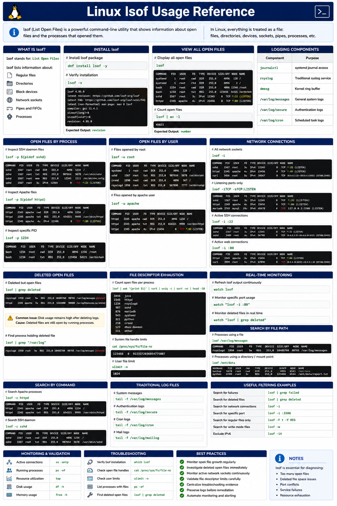

# Linux lsof Usage Reference

## Overview

This document provides a practical enterprise Linux reference for using `lsof` to inspect open files, active network connections, running processes, deleted files, and troubleshooting operational issues on RHEL 9.6 systems.

`lsof` is a critical troubleshooting utility for diagnosing file descriptor exhaustion, service failures, storage issues, and active network usage.

---

# Objective

In this reference guide you will:

- Understand Linux open file handling
- Inspect active file descriptors
- Analyze process file usage
- Troubleshoot deleted open files
- Monitor active network connections
- Identify resource exhaustion
- Troubleshoot operational issues
- Improve enterprise troubleshooting workflows

---

# What Is lsof?

`lsof` means:

```text
List Open Files
```

In Linux:

> Everything is treated as a file.

Examples:

- Regular files
- Directories
- Block devices
- Network sockets
- Pipes
- Processes

---

# Install lsof

Install the lsof package.

```bash
dnf install lsof -y
```

Expected output:

```text
Complete!
```

---

Verify installation.

```bash
lsof -v
```

Expected output:

```text
revision
```

---

# View All Open Files

Display all open files.

```bash
lsof
```

Expected output:

```text
COMMAND
PID
USER
FD
TYPE
NAME
```

---

Count open files.

```bash
lsof | wc -l
```

Expected output:

```text
number
```

---

# View Open Files by Process

Inspect SSH daemon files.

```bash
lsof -p $(pidof sshd)
```

Expected output:

```text
sshd
```

---

Inspect Apache files.

```bash
lsof -p $(pidof httpd)
```

Expected output:

```text
httpd
```

---

Inspect specific PID.

```bash
lsof -p 1234
```

Expected output:

```text
FD
```

---

# View Open Files by User

Inspect files opened by root.

```bash
lsof -u root
```

Expected output:

```text
root
```

---

Inspect files opened by Apache user.

```bash
lsof -u apache
```

Expected output:

```text
apache
```

---

# View Network Connections

Display active network sockets.

```bash
lsof -i
```

Expected output:

```text
TCP
UDP
```

---

Display listening ports.

```bash
lsof -iTCP -sTCP:LISTEN
```

Expected output:

```text
LISTEN
```

---

Display active SSH connections.

```bash
lsof -i :22
```

Expected output:

```text
sshd
```

---

Display active web connections.

```bash
lsof -i :80
```

Expected output:

```text
httpd
```

---

# Identify Deleted Open Files

Display deleted but open files.

```bash
lsof | grep deleted
```

Expected output:

```text
deleted
```

---

Common troubleshooting scenario:

```text
Disk usage remains high after deleting logs.
```

Possible cause:

```text
Deleted files still open by running process.
```

---

Identify process holding deleted file.

```bash
lsof | grep "/var/log"
```

Expected output:

```text
deleted
```

---

# Troubleshoot File Descriptor Exhaustion

Count open files per process.

```bash
lsof | awk '{print $1}' | sort | uniq -c | sort -nr
```

Expected output:

```text
process counts
```

---

View system file handle limits.

```bash
cat /proc/sys/fs/file-nr
```

Expected output:

```text
allocated
```

---

View user file limits.

```bash
ulimit -n
```

Expected output:

```text
1024
```

---

# Monitor Real-Time File Usage

Refresh lsof output continuously.

```bash
watch lsof
```

Expected output:

```text
updated output
```

---

Monitor specific port usage.

```bash
watch "lsof -i :80"
```

Expected output:

```text
httpd
```

---

# Search by File Path

Identify processes using directory.

```bash
lsof /var/log/messages
```

Expected output:

```text
rsyslog
```

---

Identify processes using mount point.

```bash
lsof /mnt/data
```

Expected output:

```text
processes
```

---

# Search by Command

Search Apache processes.

```bash
lsof -c httpd
```

Expected output:

```text
httpd
```

---

Search SSH daemon.

```bash
lsof -c sshd
```

Expected output:

```text
sshd
```

---

# Monitoring Validation

Monitor active connections.

```bash
ss -antp
```

Expected output:

```text
ESTAB
```

---

Monitor running processes.

```bash
ps -ef
```

Expected output:

```text
PID
```

---

Monitor resource utilization.

```bash
top
```

Expected output:

```text
load average
```

---

# Logging Validation

Review system logs.

```bash
journalctl -n 50
```

Expected output:

```text
systemd
```

---

Review service failures.

```bash
journalctl -p err
```

Expected output:

```text
error
```

---

Review OOM events.

```bash
journalctl | grep -i oom
```

Expected output:

```text
Killed process
```

---

# Troubleshooting

Verify lsof installation.

```bash
which lsof
```

Expected output:

```text
/usr/bin/lsof
```

---

Verify active file handles.

```bash
cat /proc/sys/fs/file-nr
```

Expected output:

```text
allocated
```

---

Verify process ownership.

```bash
ps -ef
```

Expected output:

```text
UID
```

---

Verify deleted file usage.

```bash
lsof | grep deleted
```

Expected output:

```text
deleted
```

---

# Operational Recommendations

- Monitor open file growth regularly
- Investigate deleted open files immediately
- Monitor active network sockets continuously
- Validate file descriptor limits carefully
- Centralize troubleshooting evidence
- Monitor service resource usage
- Preserve logs before remediation
- Automate operational monitoring workflows

---

# Operational Notes

Linux file descriptor handling impacts networking, storage, logging, and enterprise application reliability.

During troubleshooting validate:

- Open file counts
- Active sockets
- Deleted open files
- Service resource usage
- File descriptor limits
- Running processes
- Active user sessions
- Network connectivity

---

# Expected Outcome

After completing this reference guide:

- Linux open file handling is understood correctly
- Troubleshooting workflows improve
- File descriptor exhaustion becomes easier to diagnose
- Deleted file troubleshooting improves
- Enterprise operational diagnostics become more reliable

---


