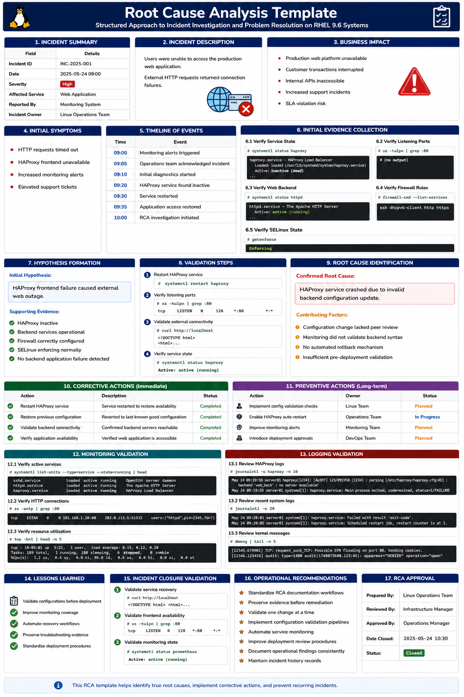

# Root Cause Analysis Template

## Overview

This document provides a structured enterprise Linux Root Cause Analysis (RCA) template for incident investigation, operational troubleshooting, outage reviews, and service recovery workflows on RHEL 9.6 systems.

The template helps standardize troubleshooting, improve operational reliability, reduce recurring incidents, and document corrective actions effectively.

---

# Objective

In this template you will:

- Structure operational incident investigations
- Document troubleshooting evidence
- Identify root causes systematically
- Validate corrective actions
- Improve incident response workflows
- Reduce recurring operational failures
- Standardize enterprise troubleshooting
- Improve post-incident reviews

---

# Incident Summary

| Field | Details |
|---|---|
| Incident ID | INC-2025-001 |
| Date | 2025-05-24 |
| Severity | High |
| Affected Service | Web Application |
| Reported By | Monitoring System |
| Incident Owner | Linux Operations Team |

---

# Incident Description

Describe the observed operational issue.

Example:

```text
Users were unable to access the production web application.
External HTTP requests returned connection failures.
```

---

# Business Impact

Document operational impact.

Example:

- Production web platform unavailable
- Customer transactions interrupted
- Internal APIs inaccessible
- Increased support incidents
- SLA violation risk

---

# Initial Symptoms

Document observed symptoms.

Example observations:

```text
- HTTP requests timed out
- HAProxy frontend unavailable
- Increased monitoring alerts
- Elevated support tickets
```

---

# Timeline of Events

| Time | Event |
|---|---|
| 09:00 | Monitoring alerts triggered |
| 09:05 | Operations team acknowledged incident |
| 09:10 | Initial diagnostics started |
| 09:20 | HAProxy service found inactive |
| 09:30 | Service restarted |
| 09:35 | Application access restored |
| 10:00 | RCA investigation initiated |

---

# Initial Evidence Collection

## Verify Service State

```bash
systemctl status haproxy
```

Expected output:

```text
inactive (dead)
```

---

## Verify Listening Ports

```bash
ss -tulpn | grep :80
```

Expected output:

```text
No output
```

---

## Verify Web Backend

```bash
systemctl status httpd
```

Expected output:

```text
active (running)
```

---

## Verify Firewall Rules

```bash
firewall-cmd --list-services
```

Expected output:

```text
http https
```

---

## Verify SELinux State

```bash
getenforce
```

Expected output:

```text
Enforcing
```

---

# Hypothesis Formation

Initial hypothesis:

```text
HAProxy frontend failure caused external web outage.
```

---

Supporting evidence:

- HAProxy inactive
- Backend services operational
- Firewall correctly configured
- SELinux enforcing normally
- No backend application failure detected

---

# Validation Steps

Restart HAProxy service.

```bash
systemctl restart haproxy
```

---

Verify listening ports.

```bash
ss -tulpn | grep :80
```

Expected output:

```text
LISTEN
```

---

Validate external connectivity.

```bash
curl http://localhost
```

Expected output:

```text
HTML
```

---

Verify service state.

```bash
systemctl status haproxy
```

Expected output:

```text
active (running)
```

---

# Root Cause Identification

Confirmed root cause:

```text
HAProxy service crashed due to invalid backend configuration update.
```

---

# Contributing Factors

Document contributing operational conditions.

Example:

- Configuration change lacked peer review
- Monitoring did not validate backend syntax
- No automated rollback mechanism
- Insufficient pre-deployment validation

---

# Corrective Actions

Document immediate remediation steps.

| Action | Status |
|---|---|
| Restart HAProxy service | Completed |
| Restore previous configuration | Completed |
| Validate backend connectivity | Completed |
| Verify application availability | Completed |

---

# Preventive Actions

Document long-term prevention improvements.

| Action | Owner | Status |
|---|---|---|
| Implement config validation checks | Linux Team | Planned |
| Enable HAProxy auto-restart | Operations Team | In Progress |
| Improve monitoring alerts | Monitoring Team | Planned |
| Introduce deployment approvals | DevOps Team | Planned |

---

# Monitoring Validation

Verify active services.

```bash
systemctl list-units --type=service
```

Expected output:

```text
running
```

---

Verify active HTTP connections.

```bash
ss -antp | grep :80
```

Expected output:

```text
ESTAB
```

---

Verify resource utilization.

```bash
top
```

Expected output:

```text
load average
```

---

# Logging Validation

Review HAProxy logs.

```bash
journalctl -u haproxy
```

Expected output:

```text
configuration error
```

---

Review recent system logs.

```bash
journalctl -n 50
```

Expected output:

```text
systemd
```

---

Review kernel messages.

```bash
dmesg
```

Expected output:

```text
kernel
```

---

# Lessons Learned

Document operational improvements.

Example:

- Validate configurations before deployment
- Improve monitoring coverage
- Automate recovery workflows
- Preserve troubleshooting evidence
- Standardize deployment procedures

---

# Incident Closure Validation

Validate service recovery.

```bash
curl http://localhost
```

Expected output:

```text
HTML
```

---

Validate frontend availability.

```bash
ss -tulpn | grep :80
```

Expected output:

```text
LISTEN
```

---

Validate monitoring state.

```bash
systemctl status prometheus
```

Expected output:

```text
active (running)
```

---

# Operational Recommendations

- Standardize RCA documentation workflows
- Preserve evidence before remediation
- Validate one change at a time
- Implement configuration validation pipelines
- Automate service monitoring
- Improve deployment review procedures
- Document operational findings consistently
- Maintain incident history records

---

# Operational Notes

Structured Root Cause Analysis improves enterprise operational reliability, incident response consistency, and troubleshooting accuracy.

During RCA investigations validate:

- Service state
- Network connectivity
- Resource utilization
- Configuration changes
- Authentication logs
- Firewall exposure
- SELinux state
- Application response

---

# Expected Outcome

After using this RCA template:

- Incident investigations become structured
- Troubleshooting workflows improve
- Operational reliability increases
- Recurring incidents decrease
- Root cause identification becomes more accurate
- Enterprise troubleshooting processes improve

---


