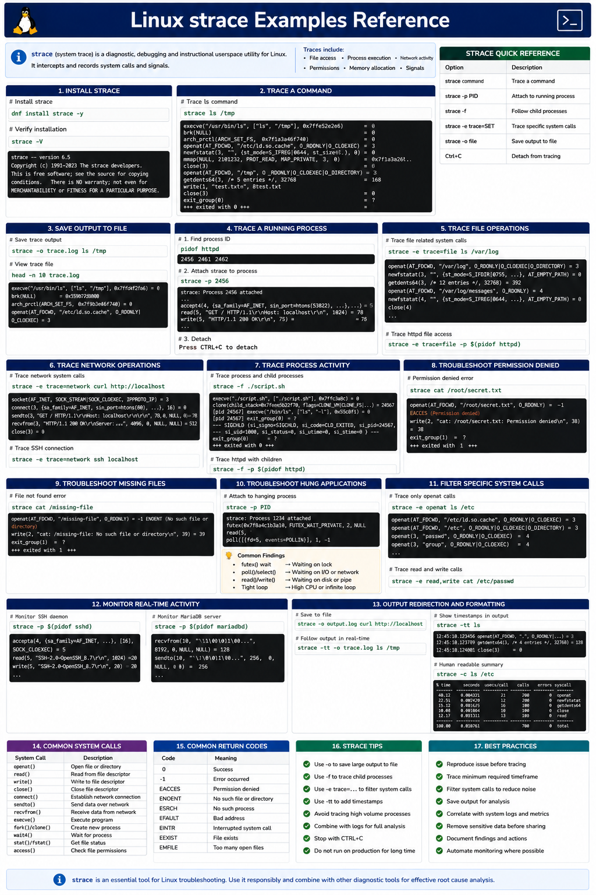

# Linux strace Examples Reference

## Overview

This document provides a practical enterprise Linux reference for using `strace` to trace system calls, diagnose application failures, inspect process behavior, troubleshoot permissions, analyze file access, and investigate operational issues on RHEL 9.6 systems.

`strace` is one of the most powerful Linux troubleshooting tools for low-level operational diagnostics.

---

# Objective

In this reference guide you will:

- Understand Linux system call tracing
- Trace running process activity
- Analyze file access operations
- Troubleshoot permission failures
- Monitor network-related system calls
- Diagnose application hangs
- Improve troubleshooting workflows
- Validate enterprise diagnostics procedures

---

# What Is strace?

`strace` traces:

```text
System calls and signals
```

Examples of traced operations:

- File access
- Process execution
- Network activity
- Permissions checks
- Memory allocation
- Signal handling

---

# Install strace

Install the strace package.

```bash
dnf install strace -y
```

Expected output:

```text
Complete!
```

---

Verify installation.

```bash
strace -V
```

Expected output:

```text
version
```

---

# Trace a Command

Trace the ls command.

```bash
strace ls /tmp
```

Expected output:

```text
openat
read
write
close
```

---

Trace a curl request.

```bash
strace curl http://localhost
```

Expected output:

```text
connect
sendto
recvfrom
```

---

# Save strace Output to File

Redirect trace output.

```bash
strace -o trace.log ls /tmp
```

---

Verify trace file.

```bash
cat trace.log
```

Expected output:

```text
execve
openat
close
```

---

# Trace a Running Process

Identify target process.

```bash
pidof httpd
```

Expected output:

```text
PID
```

---

Attach strace to process.

```bash
strace -p PID
```

Expected output:

```text
attached
```

---

Detach from process.

```text
CTRL+C
```

---

# Trace File Operations

Trace file-related system calls.

```bash
strace -e trace=file ls /var/log
```

Expected output:

```text
openat
stat
access
```

---

Trace Apache file access.

```bash
strace -e trace=file -p $(pidof httpd)
```

Expected output:

```text
openat
```

---

# Trace Network Operations

Trace network system calls.

```bash
strace -e trace=network curl http://localhost
```

Expected output:

```text
socket
connect
recvfrom
```

---

Trace SSH connections.

```bash
strace -e trace=network ssh localhost
```

Expected output:

```text
connect
sendto
recvfrom
```

---

# Trace Process Activity

Trace process creation.

```bash
strace -f ./script.sh
```

Expected output:

```text
clone
execve
```

---

Trace child processes.

```bash
strace -f httpd -DFOREGROUND
```

Expected output:

```text
fork
clone
```

---

# Troubleshoot Permission Denied Errors

Trace permission failures.

```bash
strace cat /root/testfile
```

Expected output:

```text
EACCES
```

---

Common troubleshooting scenario:

```text
Application cannot access file.
```

Possible strace evidence:

```text
Permission denied
```

---

# Troubleshoot Missing Files

Trace missing file access.

```bash
strace cat /missing-file
```

Expected output:

```text
ENOENT
```

---

Common troubleshooting scenario:

```text
Configuration file missing.
```

Possible strace evidence:

```text
No such file or directory
```

---

# Troubleshoot Hung Applications

Attach strace to hanging process.

```bash
strace -p PID
```

Expected output:

```text
futex
poll
read
```

---

Possible operational findings:

- Waiting on lock
- Waiting on network
- Waiting on disk I/O
- Infinite loop behavior

---

# Filter Specific System Calls

Trace only open system calls.

```bash
strace -e openat ls
```

Expected output:

```text
openat
```

---

Trace only read/write calls.

```bash
strace -e read,write cat /etc/passwd
```

Expected output:

```text
read
write
```

---

# Monitor Real-Time Activity

Trace active SSH daemon.

```bash
strace -p $(pidof sshd)
```

Expected output:

```text
accept
read
write
```

---

Trace database activity.

```bash
strace -p $(pidof mariadbd)
```

Expected output:

```text
recvfrom
sendto
```

---

# Monitoring Validation

Monitor active processes.

```bash
ps -ef
```

Expected output:

```text
PID
```

---

Monitor active network connections.

```bash
ss -antp
```

Expected output:

```text
ESTAB
```

---

Monitor resource utilization.

```bash
top
```

Expected output:

```text
load average
```

---

# Logging Validation

Review recent system logs.

```bash
journalctl -n 50
```

Expected output:

```text
systemd
```

---

Review service failures.

```bash
journalctl -p err
```

Expected output:

```text
error
```

---

Review authentication activity.

```bash
journalctl -u sshd
```

Expected output:

```text
Accepted publickey
```

---

# Troubleshooting

Verify strace installation.

```bash
which strace
```

Expected output:

```text
/usr/bin/strace
```

---

Verify process ownership.

```bash
ps -ef
```

Expected output:

```text
UID
```

---

Verify SELinux state.

```bash
getenforce
```

Expected output:

```text
Enforcing
```

---

Verify active file descriptors.

```bash
lsof -p PID
```

Expected output:

```text
FD
```

---

# Operational Recommendations

- Use strace during application failures
- Trace one process at a time
- Preserve trace output for escalation
- Filter traces to reduce noise
- Validate permissions carefully
- Use trace files for incident reviews
- Avoid tracing sensitive production workloads excessively
- Combine strace with logs and monitoring data

---

# Operational Notes

`strace` provides low-level operational visibility into Linux applications, services, and process behavior.

During troubleshooting validate:

- File access operations
- Permission failures
- Network connectivity
- Process hangs
- Missing files
- System call failures
- Child process activity
- Signal handling

---

# Expected Outcome

After completing this reference guide:

- Linux system call tracing is understood correctly
- Troubleshooting workflows improve
- Permission issues become easier to diagnose
- Hung process analysis improves
- Enterprise operational diagnostics become more reliable

---


