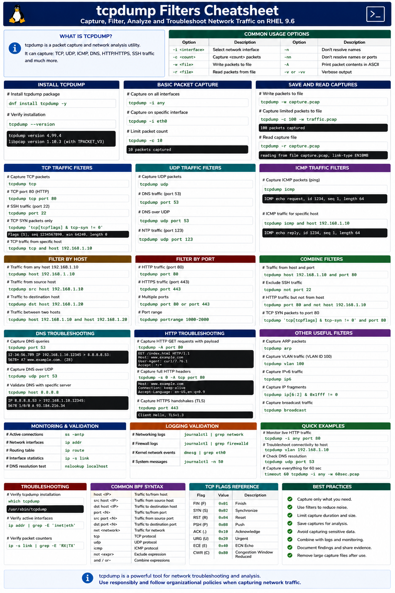

# tcpdump Filters Cheatsheet

## Overview

This document provides a practical enterprise Linux reference for capturing, filtering, analyzing, and troubleshooting network traffic using `tcpdump` on RHEL 9.6 systems.

`tcpdump` is one of the most important Linux networking and troubleshooting utilities for diagnosing connectivity issues, application failures, firewall problems, and network performance bottlenecks.

---

# Objective

In this cheatsheet you will:

- Understand packet capture workflows
- Capture live network traffic
- Filter packets efficiently
- Troubleshoot network connectivity
- Analyze application traffic
- Validate DNS and HTTP traffic
- Monitor TCP connections
- Improve enterprise troubleshooting workflows

---

# What Is tcpdump?

`tcpdump` is a:

```text
Packet capture and network analysis utility
```

It can capture:

- TCP traffic
- UDP traffic
- ICMP packets
- DNS queries
- HTTP/HTTPS traffic
- SSH connections

---

# Install tcpdump

Install tcpdump package.

```bash
dnf install tcpdump -y
```

Expected output:

```text
Complete!
```

---

Verify installation.

```bash
tcpdump --version
```

Expected output:

```text
tcpdump version
```

---

# Basic Packet Capture

Capture packets on all interfaces.

```bash
tcpdump -i any
```

Expected output:

```text
IP
```

---

Capture packets on specific interface.

```bash
tcpdump -i eth0
```

Expected output:

```text
eth0
```

---

Limit packet count.

```bash
tcpdump -c 10
```

Expected output:

```text
10 packets captured
```

---

# Capture TCP Traffic

Capture TCP packets.

```bash
tcpdump tcp
```

Expected output:

```text
Flags
```

---

Capture TCP port 80 traffic.

```bash
tcpdump tcp port 80
```

Expected output:

```text
HTTP
```

---

Capture SSH traffic.

```bash
tcpdump port 22
```

Expected output:

```text
SSH
```

---

# Capture UDP Traffic

Capture UDP packets.

```bash
tcpdump udp
```

Expected output:

```text
UDP
```

---

Capture DNS traffic.

```bash
tcpdump port 53
```

Expected output:

```text
DNS
```

---

Capture NTP traffic.

```bash
tcpdump udp port 123
```

Expected output:

```text
NTP
```

---

# Capture ICMP Traffic

Capture ping requests.

```bash
tcpdump icmp
```

Expected output:

```text
ICMP echo request
```

---

Capture ICMP on specific host.

```bash
tcpdump icmp and host 192.168.1.10
```

Expected output:

```text
echo reply
```

---

# Filter by Host

Capture traffic from host.

```bash
tcpdump host 192.168.1.10
```

Expected output:

```text
192.168.1.10
```

---

Capture source host traffic.

```bash
tcpdump src host 192.168.1.10
```

Expected output:

```text
IP
```

---

Capture destination host traffic.

```bash
tcpdump dst host 192.168.1.20
```

Expected output:

```text
IP
```

---

# Filter by Port

Capture HTTP traffic.

```bash
tcpdump port 80
```

Expected output:

```text
HTTP
```

---

Capture HTTPS traffic.

```bash
tcpdump port 443
```

Expected output:

```text
TLS
```

---

Capture multiple ports.

```bash
tcpdump port 80 or port 443
```

Expected output:

```text
HTTP
HTTPS
```

---

# Combine Filters

Capture traffic from host and port.

```bash
tcpdump host 192.168.1.10 and port 80
```

Expected output:

```text
HTTP
```

---

Exclude SSH traffic.

```bash
tcpdump not port 22
```

Expected output:

```text
non-SSH traffic
```

---

Capture TCP SYN packets.

```bash
tcpdump 'tcp[tcpflags] & tcp-syn != 0'
```

Expected output:

```text
Flags [S]
```

---

# Save Captures to File

Write packets to file.

```bash
tcpdump -w capture.pcap
```

---

Read capture file.

```bash
tcpdump -r capture.pcap
```

Expected output:

```text
reading from file
```

---

Capture limited packets to file.

```bash
tcpdump -c 100 -w traffic.pcap
```

Expected output:

```text
100 packets captured
```

---

# DNS Troubleshooting

Capture DNS queries.

```bash
tcpdump port 53
```

Expected output:

```text
A?
```

---

Capture DNS over UDP.

```bash
tcpdump udp port 53
```

Expected output:

```text
DNS
```

---

Validate name resolution traffic.

```bash
tcpdump host 8.8.8.8
```

Expected output:

```text
DNS response
```

---

# HTTP Troubleshooting

Capture HTTP GET requests.

```bash
tcpdump -A port 80
```

Expected output:

```text
GET /
```

---

Capture HTTP headers.

```bash
tcpdump -s 0 -A tcp port 80
```

Expected output:

```text
Host:
```

---

Capture HTTPS handshakes.

```bash
tcpdump port 443
```

Expected output:

```text
TLS
```

---

# Monitoring Validation

Monitor active connections.

```bash
ss -antp
```

Expected output:

```text
ESTAB
```

---

Monitor network interfaces.

```bash
ip addr
```

Expected output:

```text
inet
```

---

Monitor routing table.

```bash
ip route
```

Expected output:

```text
default via
```

---

# Logging Validation

Review networking logs.

```bash
journalctl | grep network
```

Expected output:

```text
NetworkManager
```

---

Review firewall logs.

```bash
journalctl | grep firewalld
```

Expected output:

```text
firewalld
```

---

Review kernel networking events.

```bash
dmesg | grep eth0
```

Expected output:

```text
link up
```

---

# Troubleshooting

Verify tcpdump installation.

```bash
which tcpdump
```

Expected output:

```text
/usr/sbin/tcpdump
```

---

Verify active interfaces.

```bash
ip addr
```

Expected output:

```text
eth0
```

---

Verify packet counters.

```bash
ip -s link
```

Expected output:

```text
RX
TX
```

---

Verify DNS resolution.

```bash
nslookup localhost
```

Expected output:

```text
127.0.0.1
```

---

# Operational Recommendations

- Capture only required traffic
- Limit capture duration carefully
- Preserve packet captures securely
- Filter traffic to reduce noise
- Avoid capturing sensitive production data unnecessarily
- Combine tcpdump with logs and monitoring tools
- Use packet captures during incident investigations
- Document network troubleshooting findings

---

# Operational Notes

`tcpdump` provides low-level network visibility for enterprise Linux troubleshooting and diagnostics workflows.

During troubleshooting validate:

- TCP connectivity
- DNS resolution
- HTTP/HTTPS traffic
- SSH connectivity
- Firewall filtering
- Routing behavior
- Interface activity
- Packet retransmissions

---

# Expected Outcome

After completing this cheatsheet:

- Packet capture workflows are understood correctly
- Network troubleshooting improves
- Traffic filtering becomes more efficient
- Connectivity diagnostics improve
- Enterprise operational visibility increases

---


